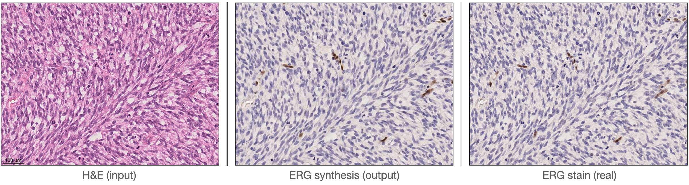

# ERG_Synthesis_model

<p align='center'>  
  
</p>


Pytorch implementation of our method for high-resolution HE histology images. This model is based on Generative Adversarial Networks (GAN) that, from an input H&E image, can generate a synthetic Erythroblast Transformation specific related gene (ERG) stained image, highlighting vessel structures. <br><br>

To use this model, follow the steps bellow.

### Installation
- Install PyTorch and dependencies from http://pytorch.org
- Install python libraries [dominate](https://github.com/Knio/dominate).
- Clone this repo:
```bash
git clone https://github.com/AzmHmd/ERG_Synthesis_model.git
cd ERG_Synthesis_model
```

### Training
- Train a model at 1024 x 512 resolution:

```python train.py --name [NAME_OF_PROJECT] --dataroot [PATH_TO_DATA] --no_instance```

- To view training results, please checkout intermediate results in `./checkpoints/[NAME_OF_PROJECT]/web/index.html`.

### Testing
- Test the model:

```python test.py --name [NAME_OF_PROJECT] --dataroot [PATH_TO_DATA] --results_dir [PATH_TO_SAVE] --no_instance```

### Docker
We also provide the pre-built Docker image and Dockerfile that can run this code repo. See `Dockerfile` and get the image by:
```docker push azmhmd/ergsynthesismodel:latest```
- the trained model is not uploaded due to the size. You can contact the authours to have access to the final generator model after training.


## Citation

If you find this useful for your research, please use the following.

```
@inproceedings{hamidinekoo2021automated,
  title={Automated Quantification Of Blood Microvessels In Hematoxylin And Eosin Whole Slide Images},
  author={A Hamidinekoo, A Kelsey, N Trahearn, J Selfe, J Shipley, Y Yuan},  
  booktitle={MICCAI Workshop on Computational Pathology},
  year={2021}
}
```

## Acknowledgments
This code borrows heavily from [High-Resolution Image Synthesis and Semantic Manipulation with Conditional GANs](https://github.com/chenxli/High-Resolution-Image-Synthesis-and-Semantic-Manipulation-with-Conditional-GANsl-).
